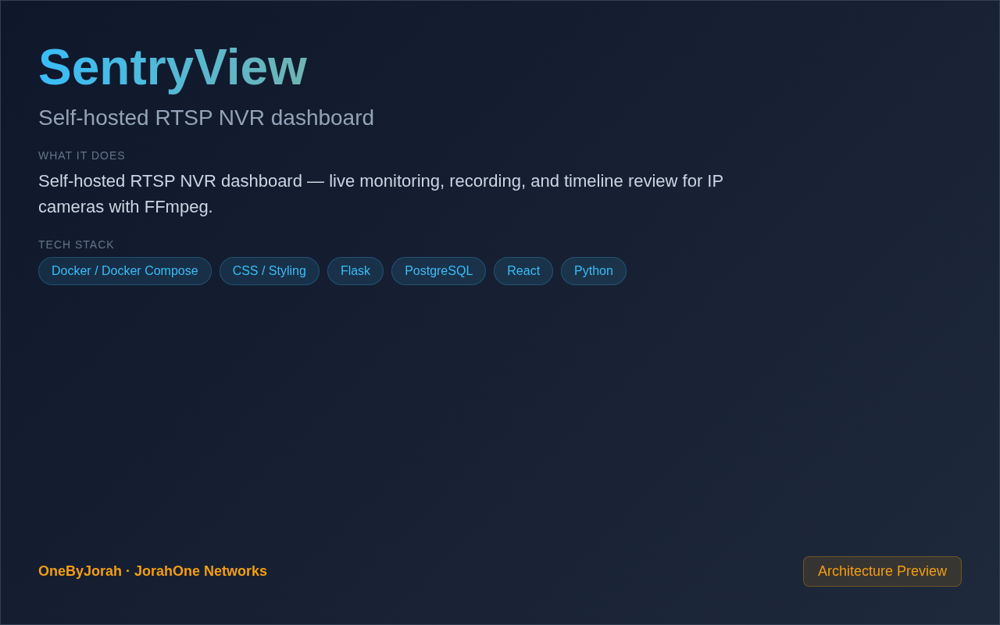
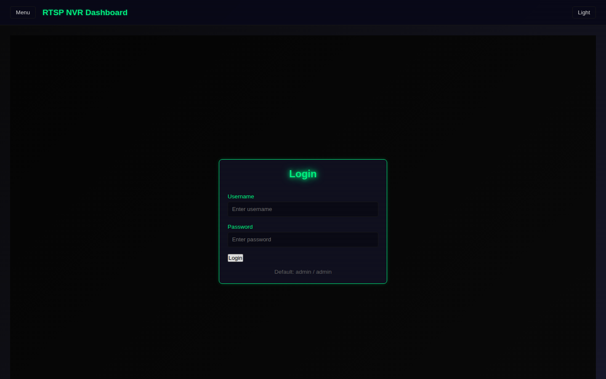
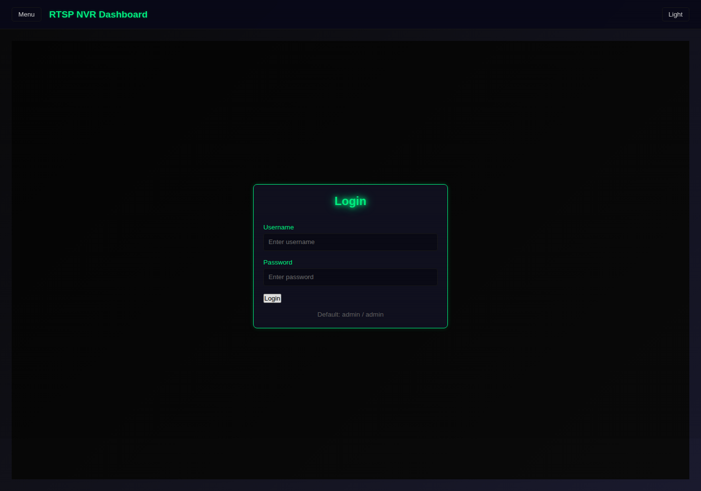

<div align="center">


# SentryView

**The self-hosted RTSP NVR dashboard for IP cameras — live monitoring, scheduled recording, timeline review, and FFmpeg processing on your own hardware.**

<a href="https://github.com/OneByJorah/SentryView/stargazers"></a>
<a href="https://github.com/OneByJorah/SentryView/commits"></a>


</div>



## What This Is

SentryView is a self-hosted network video recorder for RTSP cameras. A Flask backend manages streams, recordings, events, and schedules; a React dashboard (and an FFmpeg sidecar) handles live viewing and video processing. Everything — footage, metadata, and credentials — stays on your network.

It is for homelab and small-business operators who want multi-camera recording and timeline review without a proprietary cloud NVR or per-camera license.

## Quick Start

```bash
git clone https://github.com/OneByJorah/SentryView.git
cd SentryView

cp .env.example .env      # set POSTGRES_PASSWORD, SECRET_KEY, JWT_SECRET_KEY, RTSP_URL
docker compose up -d
```

Open the dashboard at **http://localhost:3000** (frontend). The API listens on **http://localhost:5000**.

> [!WARNING]
> `POSTGRES_PASSWORD`, `SECRET_KEY`, and `JWT_SECRET_KEY` ship with placeholder values — set real secrets in `.env` before exposing the stack. Do not expose ports 3000/5000 to untrusted networks.

## Features

- **Live monitoring** — RTSP stream management with playback through the React dashboard.
- **Recording** — on-demand and scheduled recording driven by the FFmpeg processor service.
- **Timeline review** — an Event model records recording start/stop, motion, audio, and connection events for historical review.
- **Multi-camera** — manage any number of RTSP streams, each owned by a user.
- **Stream scheduling** — cron-style schedules via APScheduler, with create/update/delete over the API.
- **JWT authentication** — registration, login, profile/password management, and logout endpoints.
- **Rate limiting & CORS** — Flask-Limiter with configurable request windows.
- **Analytics & backup** — overview analytics plus scheduled PostgreSQL backups in a dedicated container.

## Architecture

```
Browser (React) ──REST/WebSocket──▶ Flask + SocketIO ──▶ PostgreSQL
                                          │
                                          ├──▶ FFmpeg processor ──▶ RTSP cameras
                                          ├──▶ Redis (state/cache)
                                          └──▶ APScheduler (backups, schedules)
```

The Compose stack runs six services — `frontend`, `backend`, `db` (PostgreSQL 15), `redis`, `ffmpeg`, and `backup` — on a private bridge network.

## Configuration

Copy `.env.example` to `.env`. Key variables:

| Variable | Default | Description |
|----------|---------|-------------|
| `DATABASE_URL` | `postgresql://admin:***@db:5432/rtsp_nvr` | PostgreSQL connection string |
| `REDIS_URL` | `redis://redis:6379` | Redis connection string |
| `POSTGRES_PASSWORD` | `secure_password_change_me` | Postgres password — **change this** |
| `SECRET_KEY` | — | Flask secret key |
| `JWT_SECRET_KEY` | — | JWT signing key |
| `BACKEND_PORT` | `5000` | Backend host port |
| `FRONTEND_PORT` | `3000` | Frontend host port |
| `RTSP_PORT` | `8554` | RTSP media server port |
| `MOTION_SENSITIVITY` | `0.5` | Motion detection sensitivity |
| `RECORDING_RETENTION_DAYS` | `7` | Days to keep recordings |
| `EVENT_RETENTION_DAYS` | `30` | Days to keep events |
| `MAX_STREAMS` | `10` | Maximum simultaneous streams |
| `WEBSOCKET_ENABLED` | `true` | Enable real-time updates |
| `BACKUP_SCHEDULE` | `0 2 * * *` | Backup cron (daily 02:00) |

## API Endpoints

All routes are served by the Flask backend with JWT bearer auth.

| Endpoint | Method | Description |
|----------|--------|-------------|
| `/api/auth/register` | POST | Create an account |
| `/api/auth/login` | POST | Obtain a JWT |
| `/api/auth/me` | GET | Current user |
| `/api/auth/password` | PUT | Change password |
| `/api/auth/logout` | POST | End a session |
| `/api/streams` | GET/POST | List / add RTSP streams |
| `/api/streams/{id}` | PUT/DELETE | Update or remove a stream |
| `/api/recordings` | GET/POST | List / start recordings |
| `/api/recordings/{id}` | DELETE | Delete a recording |
| `/api/events` | GET/POST | Query / create events |
| `/api/schedules` | GET/POST | List / create schedules |
| `/api/schedules/{id}` | PUT/DELETE | Update or remove a schedule |
| `/api/analytics/overview` | GET | Analytics summary |
| `/api/backup` | GET/POST | Trigger / list backups |
| `/health` | GET | Liveness probe |

## Use Cases

1. **Homelab operators** — replace a proprietary cloud NVR with a self-hosted one.
2. **Small business** — multi-camera recording with timeline review and retention policies.
3. **Privacy-first setups** — keep all footage and metadata on-premises.

## Tech Stack

Flask 3, Flask-SocketIO, Flask-JWT-Extended, Flask-Limiter, PostgreSQL 15, Redis 7, APScheduler, FFmpeg, React 18 + hls.js/socket.io-client, Docker Compose.

## Screenshots

| Dashboard | Full view |
|---|---|
|  |  |

More captures live in [`docs/screenshots/`](docs/screenshots/) and [`assets/`](assets/).

## Contributing

Contributions are welcome — see [CONTRIBUTING.md](CONTRIBUTING.md). [Open an issue](https://github.com/OneByJorah/SentryView/issues) to report a bug or request a feature.

## License

MIT — see [LICENSE](LICENSE).

## Connect

- [jorahone.com](https://jorahone.com)
- [GitHub Org](https://github.com/OneByJorah)
- [info@jorahone.com](mailto:info@jorahone.com)
